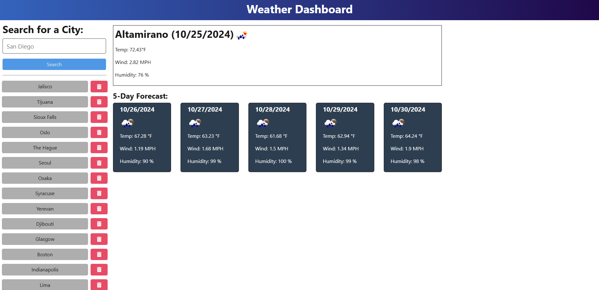

# Weather Dashboard

  ## Description
  This is a simple TypeScript-based web app for showing weather forecasts.

  ## Table of Contents
  [Installation](#installation)

  [Usage](#usage)

  [Contributing](#contributing)

  [Tests](#tests)

  [Questions](#questions)

  ## Installation
  The easiest way to use the dashboard is to go to https://weather-dashboard-70lj.onrender.com. If you wish to run the app locally, clone the repo onto your computer and cd into the Develop folder. Use "npm i" to install packages and then run "npm start" to boot up the program, which should then open in your browser.

  ## Usage
  Write the name of a city in the search bar and hit enter. Current weather shows on the top with the 5-day forcast below. Previously searched locations show up to the left.

  

  ## Contributing
  Feel free to add and modify the code. For instance, history can't be deleted yet.

  ## Questions
  My GitHub: https://github.com/ElBoyTM

  My email: nszalenski@gmail.com
